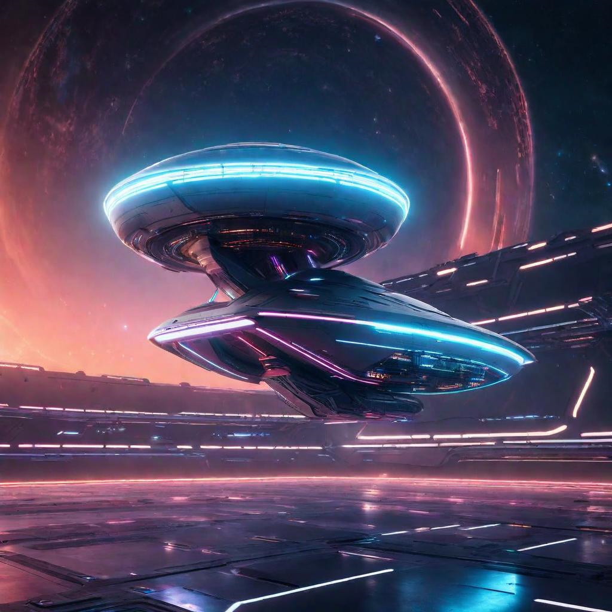

# Natural ou Fake Natty? Como Vencer na Era das IAs Generativas
<p align="center">

</p>

<p align="center">
<a href="https://dio.me/">
    
</a>
<a href="https://dio.me/">

</a>
</p>

<p align="center">
    preview do podcast
</p>

<div align="center">
    <audio src="output/podcast_editado.MP3" controls title="Podcast editado"></audio>
</div>


## 🚀 Introdução

> Woooow! Look at this 👀

Projeto Inspirado na hype _"Natty or Not"_ do fisiculturismo, este Lab da DIO te convida a conhecer o mundo das IAs Generativas, explorando o potencial dessas tendências tecnológicas incríveis!

## 🎯 Bora Pro Desafio!? Você Já Venceu 💪🤓

### Objetivos

1. **Explorar IAs Generativas**: Utilize essas tecnologias para criar conteúdos que sejam o mais realista possível. Seja criativo! Você pode produzir imagens, textos, áudios, vídeos ou combinações de tudo isso!
1. **Potfólio de Projetos**:
    1. Faça o "fork" deste repositório, criando uma cópia em seu GitHub pessoal;
    2. Edite seu README com os detalhes do seu projeto, siga nosso [Template](#template) (é só copiar, colar e preencher);
    3. Submeta o link do seu repositório na plataforma da DIO. Pronto, você acabou de fortalecer seu portfólio de projetos nos perfis do GitHub e DIO 🚀
1. **Efeito de Rede**: Compartilhe seus resultados nas redes sociais com a hashtag **#LabDIONattyOrNot**. Não esqueça de nos marcar: [DIO](https://www.linkedin.com/school/dio-makethechange) e [falvojr](https://www.linkedin.com/in/falvojr).

### Template

```markdown
# Star IA: O Despertar da Inteligência Artificial

## 📒 Descrição
Como a IA já está presente na nossa vida cotidiana

## 🤖 Tecnologias Utilizadas

- [ChatGPT](https://chat.openai.com/)
- [LimeWire](https://limewire.com/)
- [ElevenLabs](https://beta.elevenlabs.io/)
- [Capcut](https://www.capcut.com/pt-br/)

## 🧐 Processo de Criação

- Roteiro gerado via chatgpt
- Audio gerado pela elevenLabs
- Limewire Para gerar capas
- Capcut para tratar aúdio e adicionar sons de fundo

## 🚀 Resultados

[INTRODUÇÃO]**

E aí, galera! Eu sou o Darthlean e sejam muito bem-vindos ao **Star IA: O Despertar da Inteligência Artificial**! Hoje, vamos explorar um campo fascinante da IA, conhecido como IAs Generativas.
Essas inteligências são capazes de criar coisas novas, desde textos até imagens e músicas. Se você está curioso para saber como isso funciona e como já está impactando o nosso dia a dia, 
fique ligado! Vamos juntos desvendar os segredos dessa tecnologia impressionante. Apertem os cintos, porque o conhecimento vai decolar!

**[CURIOSIDADE 1]**

Vamos começar com uma curiosidade sobre como as IAs Generativas já estão presentes na nossa rotina. Você já usou algum aplicativo de edição de fotos que melhora automaticamente a imagem ou até
cria versões estilizadas dela? Pois é, isso é obra das IAs Generativas! Um exemplo famoso é o app Prisma, que transforma suas fotos em verdadeiras obras de arte, aplicando estilos de pintura
de artistas famosos. Tudo isso é feito por algoritmos de IA que analisam a imagem e aplicam os efeitos de maneira inteligente. Impressionante, não?

**[CURIOSIDADE 2]**

Agora, vamos falar sobre uma ferramenta incrível para quem quer explorar as IAs Generativas: o DALL-E, criado pela OpenAI. O DALL-E é um modelo de IA que gera imagens a partir de descrições 
textuais. Por exemplo, se você pedir uma imagem de "um astronauta descansando em uma praia tropical", o DALL-E vai criar essa imagem para você. É uma ferramenta poderosa para designers, 
artistas e qualquer pessoa interessada em criar conteúdo visual único. E o melhor de tudo, você não precisa ser um expert em programação para começar a usar e se divertir com o DALL-E!

**[FINALIZAÇÃO]**

E aí, curtiu conhecer um pouco mais sobre o universo das IAs Generativas? Espero que essas curiosidades tenham despertado seu interesse e te motivado a explorar mais sobre o assunto.
Não se esqueça de se inscrever no nosso podcast e compartilhar com os amigos! Eu sou Darthlean e esse foi o **Code Quest** dessa semana. Até a próxima, e que a força da IA esteja com você!

## 💭 Reflexão (Opcional)
Foi algo de explodir a mente no sentido de ser uma imensa descoberta toda essa tecnologia estar disponível a todos!
```

### Exemplos e Insigths

- [E-BOOK](/exemplos/E-BOOK.md)
- [Podcast](/exemplos/PODCAST.md)
- [Vídeo (Avatar Virtual)](/exemplos/VIDEO.md)

## Links Interessantes

[Base10: If You’re Not First, You’re Last: How AI Becomes Mission Critical](https://base10.vc/post/generative-ai-mission-critical/)


## 👨‍💻 Expert

<p>
    
    <p>&nbsp&nbsp&nbspLeandro Marins Lourenço<br>
    &nbsp&nbsp&nbsp
    <a href="https://github.com/Darthlean">
    GitHub</a>&nbsp;|&nbsp;
    <a href="https://www.linkedin.com/in/leandro-marins-lourenço-b6b2622b1">LinkedIn</a>
&nbsp;|&nbsp;
    </p>
</p>
<br/><br/>
<p>

---

⌨️ com 💜 por [Leandro Marins Lourenço](https://github.com/Darthlean)
